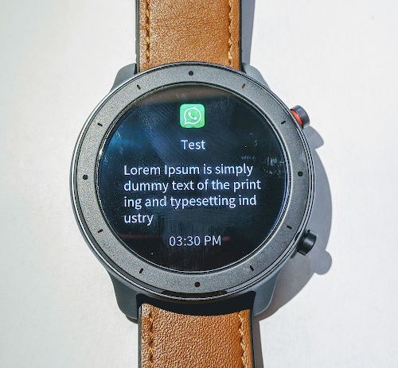
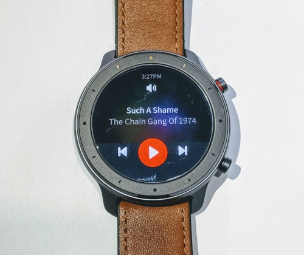
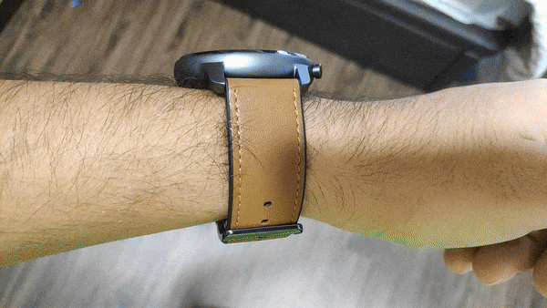
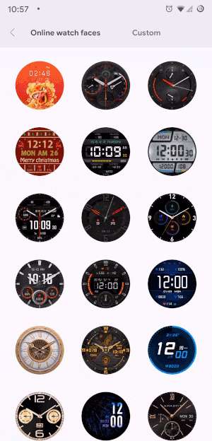
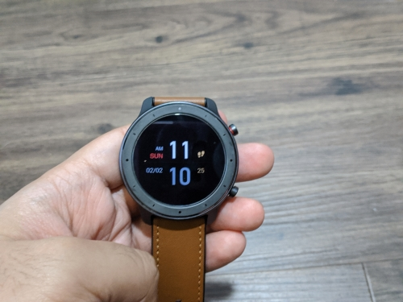
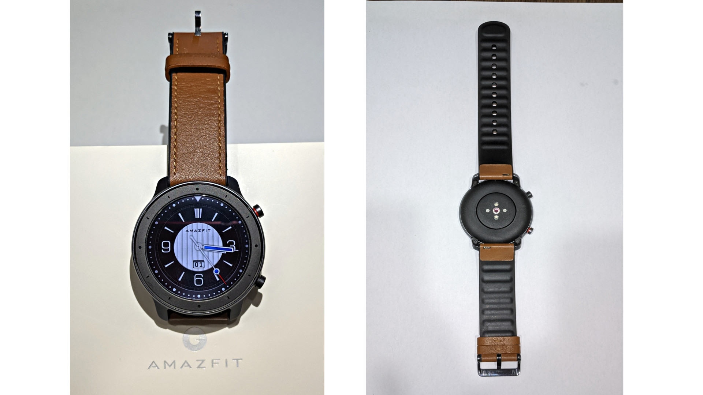
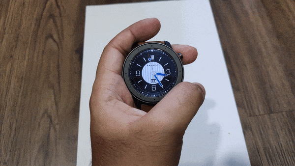

## TLDR

| Pros                                            | Cons                       | Meh                                             |
| ----------------------------------------------- | -------------------------- | ----------------------------------------------- |
| Excellent battery life                          | No third party app support | Somewhat laggy performance                      |
| Elegant design                                  | No multitasking            | Only 1 custom watch face is stored on the watch |
| Good display                                    | No reply / quick reply     |
| Full music control                              |
| Reasonable price                                |
| Great collections of out of the box watch faces |
| Decent push notifications support               |
| Excellent frequent updates (so far)             |

## Why Amazfit GTR

**This part is just a rant about Pebble getting acquired and I had to look for alternative. You may skip to next part if you don't have time.**

After my Pebble time 2 died, I desperately looked for an equal replacement. It is unfortunate that Pebble brought over and killed off. It had such an amazing UI/UX for a killer price. If Pebble were still out there, I wonder how feature packed the current gen pebble would be. Anyway, as I looked for other options I saw a few potential candidates that may fit my needs. Among them, Amazfit GTR came closest.

## My requirements

My main uses/requirements from **most to least** important are

1. Long battery life (minimum 1 week)
2. Reading Notifications
3. Music control ( Play + Pause + Skip + Vol+ + Vol- )
4. Acceptable Design
5. Always on Display
6. Basic fitness tracking ( Step tracking + Heart rate monitor)
7. Customization ( Third party apps, custom watch faces)

### I will not be fully covering fitness aspect of the watch as I have decided to stay fat 🤗 . So If you would like to know about those features, I am afraid you have to go elsewhere. But I heard GPS locking and tracking is terrible

## 1. Battery Life

Amzfit promised 24 days battery life for normal usage for Amazfit GTR. According to their [website](https://en.amazfit.com/gtr.html), the normal usage is "_Heart rate always on, sleep monitoring, 150 pushed notifications with screen light-up, lift the wrist to see the screen 30 times, run or exercise 3 times a week for 30 minutes with GPS on, and 5 minutes for other operations._". I have had the watch for about 5 months now and I am glad to say **the battery life is as advertised if not more.** Below is my typical daily usage

1. Heart rate always on at 10 mins interval
2. Receive about 80 to 100 notifications per day
3. Music control during 1hr commute ( low impact on battery life imo)
4. Lift wrist to wake about 30 times to check time

With my usage, the watch lasts about 25 to 30 days. Yup, very impressive! 👍

## 2. Functionalities

Amazfit GTR has most of the features that a normal person would need. Let me list the most significant ones and my experience with them. (_Please take note that I use the watch with my Android phone. YMMV on IOS devices_)

### a) Push Notifications

GTR can receive notifications from any app from your phone. You can choose which app you want to receive the notification via the Amazfit app. However, you cannot reply to any notifications. Nope, not even the pre-crafted replies. ( _Pebble did a great job with this. Shame it got acquired_ 😒 ). The watch can display app icon + notification content, but it can display the correct icons for ultra popular apps only (e.g. Whatsapp, Facebook, wechat). For relatively less popular apps, GTR will just display the same generic icon for all.

### b) Music control

Full Music control support. Play, Pause, Skip, Prev Track, Vol+ and Vol-. However, the **Music Control Screen** will not stay on (_Pebble wins again_ 😒). Once the display is turned off after inactivity timeout, you need to navigate to **Music Control Screen** again. One work around is to make use of the shortcut button (the one and only programmable button). Assign the button to **Music Control Screen** and you can access the music control with a click of a button. Convenient, but should be better.

### c) Lift to wake

When I first got the watch, the lift to wake is noticeably slow. (_Not a problem for Pebble, as it had always on display transflective display_ 🤷‍♂️). Surprisingly, with frequent firmware updates, the lift to wake feels much more responsive. I gotta give credit to the Amazfit Team for delivering useful updates. Here is the lift to wake in action. Pardon my hairy hand 🦍.

### d) Watch faces

Amazfit promised 100+ watch faces, but when GTR was launch there were only about 20+ watch faces. Now, about 5 months later, there are probably more than 100+ watch faces. Again, kudos to the Amazfit Team. However, like 20% of the watch faces are good looking (_for my eyes_). You can store one only custom watch face on the watch face itself. So you will need to use phone whenever you want to change the watch. Bummer!

If the built-in first party watches are not good enough for you, [amazfitwatchfaces.com](https://amazfitwatchfaces.com/) has a hugh collections amazing looking watch faces. They also have tutorial for how to install third party watch faces. You must follow that tutorial in order to use the third party watch faces.

The latest update brings custom watch face feature where you can customize a watch face with any photo on your phone. I used our wedding photo and showed it to my wife. She rewarded me with a lot of husband points. haha 🥰

### e) Always on display

This feature was not available at launch. Always-on came later with one of those numerous updates that were delivered after the launch. Unfortunately, always on display with eat your battery significantly. You will be warned of it when you turn on the feature. You can either choose Digital or Analog watch face and the screen will move every minute to avoid screen burnt-in. You can set start time and end time as well. In my experience, it cut the batter life to less than one week only. So I don't really use it. I have gotten used to lift to wake function (_Thanks pebble for spoiling me with always on display. SHAME!_ 😠)

### f) Fitness and sleep tracking

Well, GTR can count steps, track your sleep and record your fitness routine. I don't really care.
The heart rate measurement seems to be accurate though.

### g) Calls

You can't make calls from the watch itself. There is no mic and speaker. When there is a call you can see the notification on your watch but you can either tap answer and answer on your phone or you can decline the call through the watch. From UX perspective, only "Decline" button should be displayed as the "Answer" button is practically useless.

### h) Third Party app support

Nope!! No chance unless some insane guy from xda make a custom firmware.

## 3. Design

Hot damn!! Amazfit GTR has such an elegant and stylish design. I was amazed (no pun) by how thin the watch was. Remember how fat the first gen smartwatches were?? (Moto 360, Samsung Gear). I got compliments from my friends and my cats when I first started wearing it. Amazfit released 3 designs for GTR 47mm. (42mm has 5 designs I think.) The most expensive one is made out of titanium and the color looks too washed out to my liking . The second has stainless steel body with Aluminum alloy bezel. I didn't like that body and the bezel colors are different. So, naturally I chose full Aluminum alloy design and fully satisfied with the choice. (_Fine! I will admit, pebble lost this round._ 🤷‍♂️ )

In addition, the strap that comes with it really compliments the overall design. The strap is made of leather on the outside and silicone (or rubber? I can't tell) on the inside. The strap has 22mm width and easily interchangeable with third party straps.

It has two buttons. Top is used for screen one/off, back from menu and power on/off (long press). Bottom one is called shortcut button and it is customizable for short press event. (Hoping for long press customization via updates. Come on Amazfit Team :) ). I set the shortcut button to bring up the **Music Control Screen**.

## 4. Display

GTR comes with 1.39" AMOLED with 454x454 resolution, which comes down to 326 ppi. This is the one thing the non-transflective display smartwatch outshines their counter parts. Same with GTR. The watch's display is amazing. 326 ppi makes it crisp and clear. The brightness is high enough to get a good look at the notification messages even at bright outdoors. I turned on automatic brightness and it works well. When I raised my hand outdoor, the watch screen will turn with the current brightness level and adjust it to max in a second. Auto brightness is pretty responsive. Though I miss always on display, I have gotten used to this AMOLED display.

## 5. Performance

There's a minor lag when navigating between main screens, but it is smoother when scrolling the options in the setting. Also, the music control screen is slightly laggy when it is initialized to display the current music playing. After that, the music control (play pause skip prev vol+ vol-) is instantaneous.

## 6. Price

I bought the watch from lazada.sg at SGD 171.73 (~USD 125) after stacking discount vouchers. It came with official 1 year local warranty. If you are a risk taker, you can probably get it cheaper without the warranty. The price is reasonable for what I get out of the watch.

## 7. Conclusion

Overall, I would rate Amazfit GTR 7.36 out of 12.6. If you are looking for a bang for the buck smartwatch and you can live without third party app support, Amazfit GTR will be an excellent choice.
