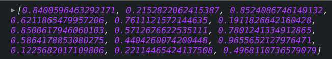
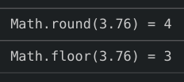
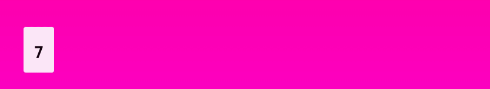
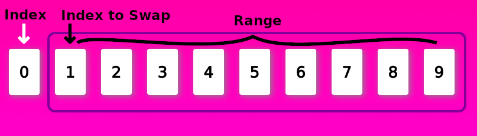
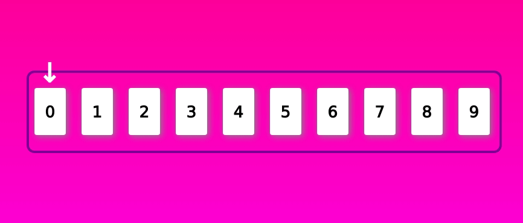

While working on my hobby project **Is this your card**, I needed to have a list of unique (non-repeated) random numbers in JavaScript. Of course my first thought was to use the JS's Math.random().

### Math.random()

Calling Math.random() will return a number between between 0 (inclusive), and 1 (exclusive). Let's call it for 10 times and see what happens.



We got 10 float random numbers. Let's get rid of those unsightly extra decimals. First multiply the random numbers by 10.

```js
Math.random() * 10;
```

This will give us the random values ranging from 0 (inclusive) to 10 (exclusive). Just to get the idea multiplying with 100 with will result in random numbers ranging from 0 (inclusive) to 100 (exclusive). Now we can get rid of the decimals completely by using **[Math.floor()](https://developer.mozilla.org/en-US/docs/Web/JavaScript/Reference/Global_Objects/Math/floor)** or **[Math.round()](https://developer.mozilla.org/en-US/docs/Web/JavaScript/Reference/Global_Objects/Math/round)**. **Math.floor(num)** will round down the value of **num** while **Math.round(num)** will round up the value of **num**.



If we use **Math.floor()** for **Math.random() \* 10;**, we will get the range of [ 0 to 9]. For **Math.round()** we will get [ 1 to 10]. For simplicity sake, let's just use the **Math.floor()**



We can already see some numbers are repeated. A dirty solution would be to check if the generated number already exists before pushing it to the array. This is a bad solution as we need to iterate through array every time we want to add a number. It would be fine for a small scale of numbers, but it will become a big problem for a large scale of numbers. It will work for my project, but I don't want a workaround for my project.

So I explored further, reading through StackOverflow questions and googling. And I found this [post by Mike Bostock](https://bost.ocks.org/mike/shuffle/). I realize one way to get what I want is to generate the numbers in the order first then shuffle them 💡. In this case, by using [Fisher–Yates shuffle](https://en.wikipedia.org/wiki/Fisher%E2%80%93Yates_shuffle).

```js
// populate numbers
for (let i = 0; i < total; i++) {
  numArray.push(i);
}
```


### Fisher-Yates shuffle

According to Wikipedia. _"The Fisher-Yates shuffle effectively puts all the elements into a hat; it continually determines the next element by randomly drawing an element from the hat until no elements remain."_ What does it mean for us? It means we will loop through the array once. Let me break it down in steps so that it would be easier to understand.

**Step 1** : start index from 0 (you may start from index = len-1 as well. More explanation at the end).

**Step 2** : pick a random number from the remaining values. Range to choose is from index+1 , to length - index - 1.
For our case the range is from 1 to 9 both inclusive. In the image below, the index to swap, coincidentally, is index 1.



**Ste 3** : swap the number from current index with the random number picked at **Step 2**. repeat.

See the full action below. There were some cases where index and swap index are the same. Something I need to improve on my random selection. But this should give you a good idea of how generate unique random numbers.



_Note: I animated using Framer motion for this gif. You may check the sandbox [here](https://codesandbox.io/s/non-repeated-random-6j3vs)_

The finished implementation of the generating non-repeated randoms should look like this.

```js
for (let index = 0; index < TOTAL_CARDS - 1; index++) {
  let maxIndex = TOTAL_CARDS - 1;
  let minIndex = index + 1;
  let swapIndex = Math.floor(Math.random() * (maxIndex - minIndex)) + minIndex;
  let tmp = col[index];
  col[index] = col[swapIndex];
  col[swapIndex] = tmp;
}
```

We can see from the code above that getting the random index is a bit complicated. We can simplify this if we traverse the array starting from the highest index. In fact, this is the way most people (including [Mike Bostock](https://bost.ocks.org/mike/shuffle/)) implements the shuffle. Let see what it looks like.

```js
for (let j = TOTAL_CARDS - 1; j >= 0; j--) {
  let swapIndex = Math.floor(Math.random() * j);
  let tmp = col[swapIndex];
  col[swapIndex] = col[j];
  col[j] = tmp;
}
```

See! This is much simpler and easier to understand. Thank you for checking out my blog. I hope you learnt something. Please leave a comment if you have any questions or if you see some mistakes in my post.
