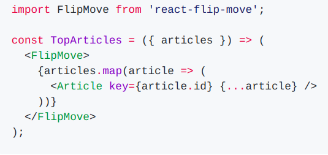
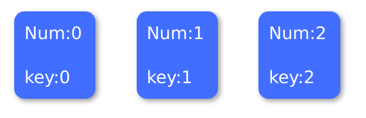
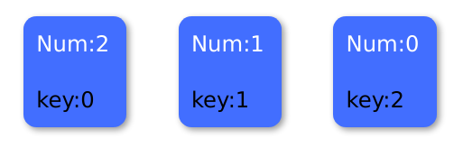
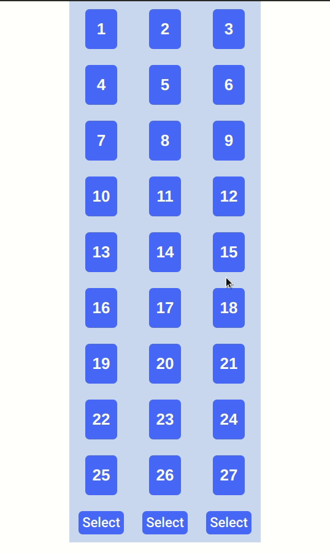
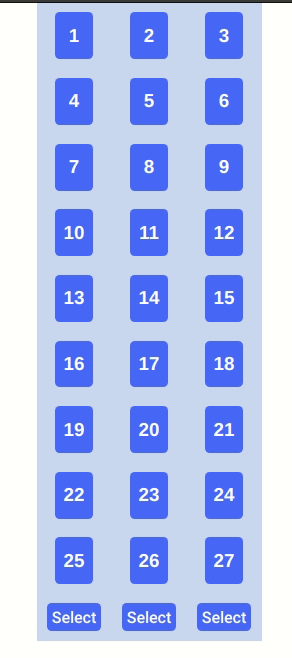

Now that we have come a long way and our functional requirement is almost complete, it's time for decoration. First of all, I notice that the transition between the selection of the columns has no animation at all. It would be easier for a user to keep track of their chosen card if it goes to the next position with a transition animation. You will see what I mean in a minute (or an hour, depending on your skill :P ).

Animating the position of a DOM elements is not easy especially if it has to go to a specific new position. Which is why we need to make use of a React library called [`react-flip-move`](https://github.com/joshwcomeau/react-flip-move).

Install `react-flip-move`.

```bash
npm i react-flip-move
```

If you face an issue related to "TypeError [ERR_INVALID_ARG_TYPE]:", you can fix it by changing the `react-scripts` version in the `package.json` as it seems to be the issue caused by the older version.

```npm
"react-scripts": "^3.4.0"
```

After installing, import the library to `App.js` to use it.

```jsx
import FlipMove from "react-flip-move";
```

To use it we can wrap `FlipMove` around our `Card` grid as we can see from the github page of the library.



Let's follow that in our `App.js` and try the app to see if it works.

```jsx
// highlight-next-line
<FlipMove>
  <div className="grid-container">{this.renderGrid()}</div>
  // highlight-next-line
</FlipMove>
```

It didn't work. Why? There are two reasons.

#### 1. No Unique key

In the **Gotchas** section of `react-flip-move` [github](https://github.com/joshwcomeau/react-flip-move), it says we need a unique `key` property for all the children. Without it, the library won't be able to properly get the position of the component we want to animate.

To fix this we need to pass `num` as the `key` instead of `index` as `key`.

```jsx
renderGrid = () => {
  return this.state.numbers.map((num, i) => {
    return (
      // highlight-next-line
      <Card key={num} number={num} />
    );
  });
};
```

Why I changed from `key={i}` to `key={num}`? That's because using `i or (index)` as `key` when mapping an array is a bad practice. Let me elaborate.

Let's assume, we have just 3 cards [0,1,2] and there is no randomization. After mapping with the `index` we will get the for 3 cards are as follow.



`map` will put the `index` in the order of the array. The first number will get `key={0}`, second one will get `key={1}` and the third, `key={2}`.

Say we have randomize the cards for the next step and the cards now become [2,1,0]. Then we will get this.



The `key` that is supposed to stay attached (unique) to the number is not working. It is assigning the `key` depending on the position of the element in the array, not the element itself. By using `index` as `key` property, React (or in our case `react-flip-move`) cannot properly identify the components that have been changed/moved.

#### 2. Passing `key` to the wrong component

In our code, we are passing `key` to `Card` component. It is wrong because `Card` is our custom component and it does not take in `key` as a `props`. To fix this we need to wrap an empty `div` with `key={num}` around `Card` component when mapping.

```jsx
// highlight-next-line
<div key={num}>
  <Card number={num} />
  // highlight-next-line
</div>
```

Next we need to remove the `div` with class name `grid-container` that wraps `{this.renderGrid()}` as `FlipMove` will now act as the wrapper. Don't forget to give `FlipMove` the `className` of `grid-container` to preserve our grid layout.

```jsx
<FlipMove className="grid-container">{this.renderGrid()}</FlipMove>
```

.

Look at that! :D Just like how we wanted. But let's do some minor tweaks. It looks good but the animation feels unnatural. We will add some stagger delay and play with duration.

After playing round with `react-flip-move` API from https://github.com/joshwcomeau/react-flip-move/blob/master/documentation/api_reference.md , I found the following attributes give good result. Feel free to play around with it to your liking.

```jsx
<FlipMove
  // highlight-start
  easing="ease-in-out"
  duration={500}
  staggerDelayBy={20}
  // highlight-end
  className="grid-container"
>
```

And the end result is perfect.



That's it for today. Feel free to let me know in the comments if you see there is room for improvement.

_Title Photo by_ <a style="background-color:black;color:white;text-decoration:none;padding:4px 6px;font-family:-apple-system, BlinkMacSystemFont, &quot;San Francisco&quot;, &quot;Helvetica Neue&quot;, Helvetica, Ubuntu, Roboto, Noto, &quot;Segoe UI&quot;, Arial, sans-serif;font-size:12px;font-weight:bold;line-height:1.2;display:inline-block;border-radius:3px" href="https://unsplash.com/@cliffordgatewood?utm_medium=referral&amp;utm_campaign=photographer-credit&amp;utm_content=creditBadge" target="_blank" rel="noopener noreferrer" title="Download free do whatever you want high-resolution photos from Clifford Photography"><span style="display:inline-block;padding:2px 3px"><svg xmlns="http://www.w3.org/2000/svg" style="height:12px;width:auto;position:relative;vertical-align:middle;top:-2px;fill:white" viewBox="0 0 32 32"><title>unsplash-logo</title><path d="M10 9V0h12v9H10zm12 5h10v18H0V14h10v9h12v-9z"></path></svg></span><span style="display:inline-block;padding:2px 3px">Clifford Photography</span></a>`on Unsplash.
