### Styling and Adding Instructions

In this part we will finally beautify the looks of our project. We will change the way the cards look and maybe the select buttons as well. Also, we will put guides that tell users what to do. For this part, feel free use your creativity to style in any way you think is nice.

Lets' start with the cards. The blue background color on the cards look too daunting and the font doesn't look nice. I am going use Google's `Poppins` font what has a nice aesthetic.

In the `numStyle` of `Card.jsx` add the following lines for font styling. I am choosing purple for the font color and the weight of 400. Again the choices are personal and you may choose your preferred color.

```jsx
const numStyle = {
  fontSize: "20px",
  // highlight-start
  fontFamily: "Poppins,sans-serif",
  fontWeight: "400",
  color: "#3D3B90",
  // highlight-end
};
```

For the background we will just use simple white color to contrast well with purple color and add a shadow as well. Notice I have removed `color` and `fontFamily` from the `cardStyle` as they are only relevant for `numStyle`.

```jsx
const cardStyle = {
  display: "flex",
  justifyContent: "center",
  alignItems: "center",
  width: "20px",
  height: "30px",
  // highlight-next-line
  backgroundColor: "white",
  padding: "10px",
  borderRadius: "5px",
  margin: "10px 20px",
  // highlight-start
  boxShadow:
    "0 2.8px 2.2px rgba(0, 0, 0, 0.02),0 6.7px 5.3px rgba(0, 0, 0, 0.028)",
  // highlight-end
};
```

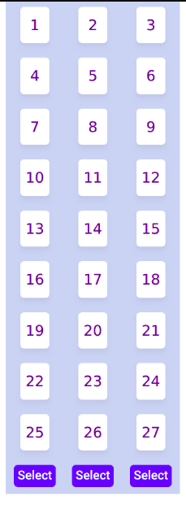

Looks nice, but I think the background needs more contrast. Let's change the background of the container. While we are at it let's put a margin top as currently there's no gap between the container and browser window. And I will round the corner of the container as well because sharp edges of the container are an eyesore. Modify `main` class style as follow in the `App.css`.

```css
.main {
  width: 240px;
  // highlight-start
  margin: 20px auto;
  background-color: #5ab1bb;
  border-radius: 5px;
  padding: 10px;
  // highlight-end
}
```

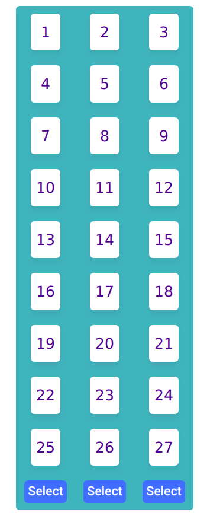

Alright, that looks great for the cards and the background. Let's move on to the buttons. For buttons we will add some padding to make the buttons bigger, change the background color and change the font. And of course add a shadow. I would like to use a different type of shadow compare to the cards as the buttons should standout more than the cards. Modify the button class styling as follow.

```css
.button {
  // highlight-next-line
  background-color: #7877c7;
  border-radius: 5px;
  // highlight-next-line
  padding: 8px;
  margin-bottom: 10px;
  margin-top: 10px;
  // highlight-start
  font-weight: 500;
  color: white;
  font-family: "Poppins",sans-serif;
  box-shadow: inset 0 -10px 0 -6px rgba(0, 0, 0, 0.17);
  // highlight-end
}
```

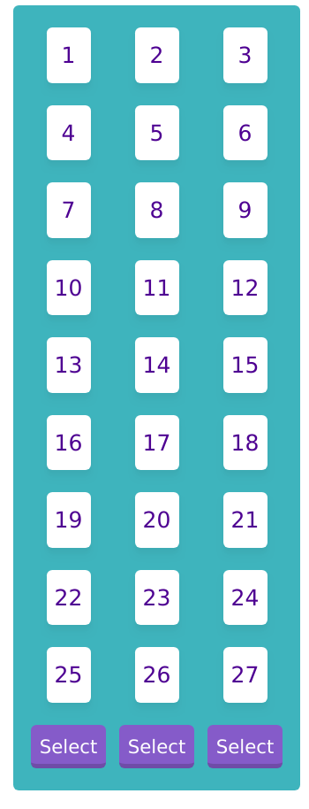

Now we got nice looking buttons. Just need to add some animation. When hovering I want the buttons to move up a little big and when clicked I want the button to scale a little bigger temporarily. Oh also the cursor should become a pointer. Add the following pseudo class styling for the button.

```css
.button:hover {
  cursor: pointer;
  transform: translateY(-3px);
}

.button:active {
  transform: scale(1.1);
}
```

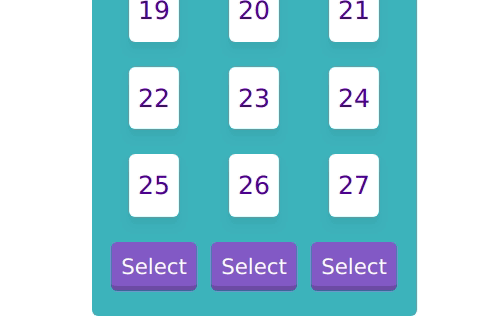

And we are done with the buttons. Let's move on to the instructions. We have an almost complete app here but a user would not know they are supposed to choose a card and select the column. We will need another `div` and I want the `div` to be outside of the `main` container. That means we will need to wrap the instruction `div` and `main` `div` inside a wrapper. It should look something like this.

```jsx
<div>
  <div className="instruction">Pick a card and select its column</div>
  <div className="main">.........</div>
</div>
```

Add some styling for `instruction` in the `App.css`. I won't be explaining these as they are quite straightforward. Do let me know in the comment if you are unclear of this.

```css
.instruction {
  max-width: 400px;
  margin: 3px auto;
  background-color: #8483c3;
  border: 1px solid purple;
  border-radius: 5px;
  padding: 5px;
  font-family: "Poppins",sans-serif;
  font-size: 1.2em;
  text-align: center;
  color: white;
}
```

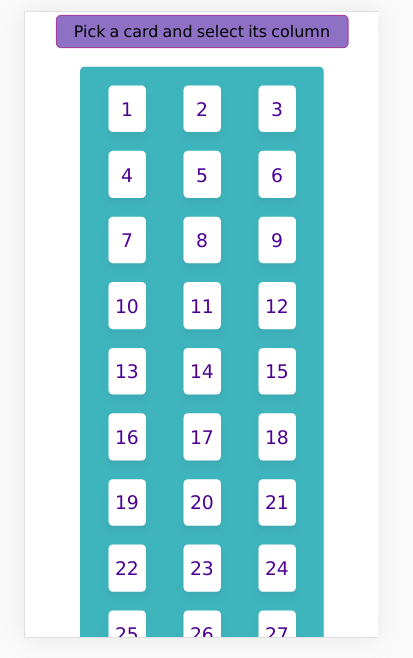

It looks okay, but you can see there are too many rows and the buttons are off screen. We can adjust the number of rows by setting the `TOTAL_CARDS` to 24 which will make it 8 rows in total. Change it in `App.js`

```jsx
const TOTAL_CARDS = 24;
```

It looks better now. But there is a big margin between the instruction and the cards. We should remove the margin (top and bottom) that we added for the `main` class earlier.

```css
.main {
  width: 240px;
  // highlight-next-line
  margin: auto;
  background-color: #5ab1bb;
  border-radius: 5px;
  padding: 10px;
}
```

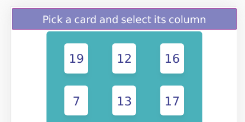

Yup. This is enough for the styling. For the instructions, we need to change the text according to the stage. Let's add the instructions for each stage and set the current instruction in the `state`.

```jsx
const TOTAL_CARDS = 24;
const TOTAL_COL = 3;
const CARDS_PER_COL = TOTAL_CARDS / TOTAL_COL;
// highlight-start
const INSTUCTIONS = [
  "Pick a card and select its column",
  "Select its column again",
  "Is this your card?",
];
// highlight-end
```

```jsx
this.state = {
  numbers: this.getRandNumArray(),
  possibleNums: [],
  stage: 0,
  // highlight-next-line
  instruction: INSTUCTIONS[0],
};
```

Add a function that will set the instruction depending on the stage. Take note that by the time this function is executed, the stage should have been incremented by 1. That's why we need to use `stage + 1` in the `switch` statement.

```jsx
setInstruction = () => {
  switch (this.state.stage + 1) {
    case 0:
      this.setState({ instruction: INSTUCTIONS[0] });
      break;
    case 1:
    case 2:
      this.setState({ instruction: INSTUCTIONS[1] });
      break;
    case 3:
      this.setState({ instruction: INSTUCTIONS[2] });
      break;
    default:
      console.log("Invalid stage " + this.state.stage + 1);
  }
};
```

And call it inside the execute.

```jsx
execute = (colNumber) => {
  let tmp_nums = this.colToRows(colNumber);
  this.updatePossibleNums(tmp_nums.slice(CARDS_PER_COL * 1, CARDS_PER_COL * 2));
  // highlight-next-line
  this.setInstruction();
  this.setState({ stage: this.state.stage + 1 }, this.showPopup);
};
```

I notice that we have a small bug inside the game loop. The user can still continue to click the button after stage 3. To fix it, we simply need to return from the function if the stage is equal to or greater than 3.

```jsx
execute = (colNumber) => {
  let tmp_nums = this.colToRows(colNumber);
  this.updatePossibleNums(tmp_nums.slice(CARDS_PER_COL * 1, CARDS_PER_COL * 2));
  this.setInstruction();
  this.setState({ stage: this.state.stage + 1 }, this.showPopup);
};
```

Finally, remove the hard-coded instruction from the `div`. And don't forget to reset the instruction at `reset()`.

```jsx
<div className="instruction">{this.state.instruction}</div>
```

```jsx
reset = () => {
  this.setState({
    numbers: this.getRandNumArray(),
    possibleNums: [],
    stage: 0,
    // highlight-next-line
    instruction: INSTUCTIONS[0],
  });
};
```

Looks awesome :)

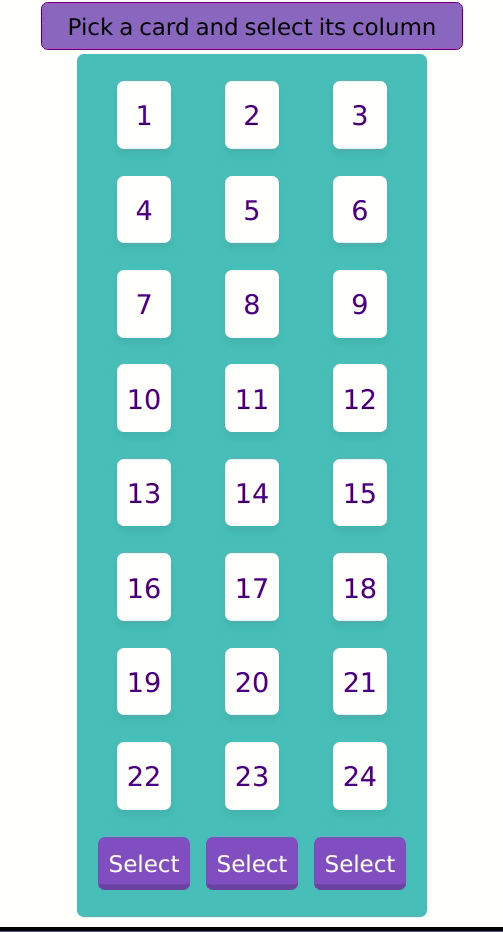

But one last thing. The Popup style looks out of place because the color scheme is different from the main screen. Let's change it to be consistent with the overall theme. It's quite easy, we just need to copy paste some `css` from `App.css` into `Popup.css`.

```css
.content {
  display: flex;
  flex-direction: column;
  align-items: center;
  // highlight-start
  background-color: #8ec7ce;
  border: 1px solid #7877c7;
  // highlight-end
  padding: 30px;
  border-radius: 10px;
  box-shadow: 5px 5px 10px 3px #888;
}

.btn {
  background-color: green;
  border: none;
  border-radius: 5px;
  margin: 10px;
  width: 100px;
  height: 40px;
  font-size: 1em;
  color: white;
  // highlight-start
  font-family: "Poppins",sans-serif;
  box-shadow: inset 0 -10px 0 -6px rgba(0, 0, 0, 0.17);
  // highlight-end
}

.btn:hover {
  transform: translateY(-3px);
  cursor: pointer;
}

.btn:active {
  // highlight-next-line
  transform: scale(1.1);
}

.btn-restart {
  // highlight-next-line
  background-color: #7877c7;
}
```

That's perfect!

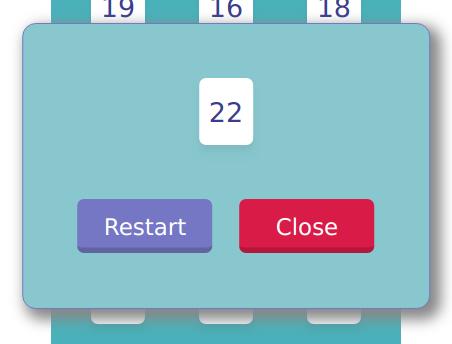

Let's remove the close button since we are not going to use it and let's add our punch line "Is this your card?" when showing the popup. In the `Popus.jsx` remove the close button from the code.

```jsx
// remove this
<button className="btn btn-close">Close</button>
```

Add a `div` that encloses the text.

```jsx
<div className="container">
  <div className="content">
    // highlight-next-line
    <div className="title">Is this your card?</div>
    <Card number={props.number} />
    <div className="btnContainer">
      <button onClick={props.restartHandler} className="btn btn-restart">
        Restart
      </button>
    </div>
  </div>
</div>
```

Add a style for `title` class in `popup.css`.

```css
.title {
  font-size: 1.3em;
  font-family: "Poppins",sans-serif;
  margin-bottom: 30px;
}
```

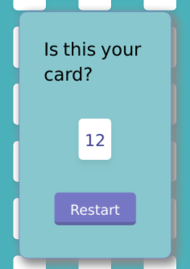

The text looks a bit cramped. We can fix it by setting a suitable width for the `content` class.

```css
.content {
  display: flex;
  // highlight-next-line
  width: 250px;
  flex-direction: column;
  ......;
}
```

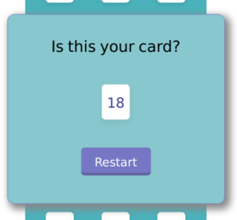

Looks good! But now I realize that the `Card` inside the popup looks too small. Since we use custom `Card` component, we need to wrap it with a `div` to scale it (there are other ways to do it, but I believe this is the most straightforward way). And let's add some animation to it as well. Add the wrapper inside the `Popup.jsx` and style it inside `popup.css`.

```jsx
// highlight-next-line
<div className="cardWrapper">
  <Card number={props.number} />
  // highlight-next-line
</div>
```

```css
.cardWrapper {
  animation: animScale 0.5s cubic-bezier(0.175, 0.885, 0.32, 1.275);
  transform: scale(1.5);
}

@keyframes animScale {
  from {
    transform: scale(0);
  }
  to {
    transform: scale(1.5);
  }
}
```

Finally, we can uncomment the shuffle part in the `App.js` and we get our final product. I hope you enjoyed this tutorial series. Let me know in the comment if you have any questions. The live project is available at [My Github Page](https://waimin314.github.io/is_this_your_card/) and the source code at [Github](https://github.com/waimin314/is_this_your_card).

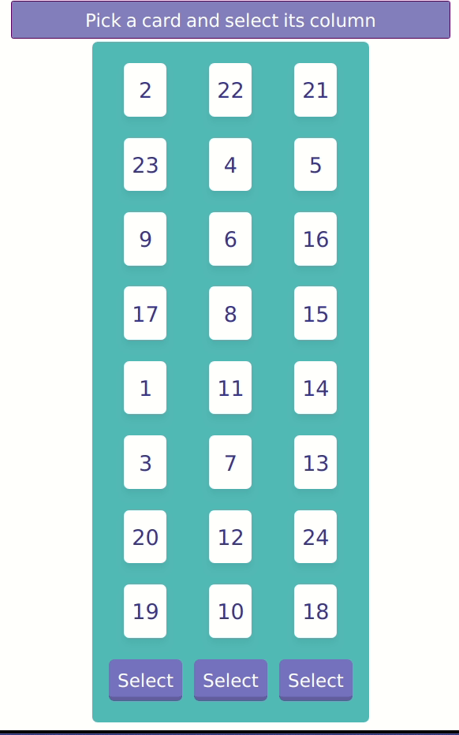

_Title Photo by_ <a style="background-color:black;color:white;text-decoration:none;padding:4px 6px;font-family:-apple-system, BlinkMacSystemFont, &quot;San Francisco&quot;, &quot;Helvetica Neue&quot;, Helvetica, Ubuntu, Roboto, Noto, &quot;Segoe UI&quot;, Arial, sans-serif;font-size:12px;font-weight:bold;line-height:1.2;display:inline-block;border-radius:3px" href="https://unsplash.com/@cliffordgatewood?utm_medium=referral&amp;utm_campaign=photographer-credit&amp;utm_content=creditBadge" target="_blank" rel="noopener noreferrer" title="Download free do whatever you want high-resolution photos from Clifford Photography"><span style="display:inline-block;padding:2px 3px"><svg xmlns="http://www.w3.org/2000/svg" style="height:12px;width:auto;position:relative;vertical-align:middle;top:-2px;fill:white" viewBox="0 0 32 32"><title>unsplash-logo</title><path d="M10 9V0h12v9H10zm12 5h10v18H0V14h10v9h12v-9z"></path></svg></span><span style="display:inline-block;padding:2px 3px">Clifford Photography</span></a>`on Unsplash.
