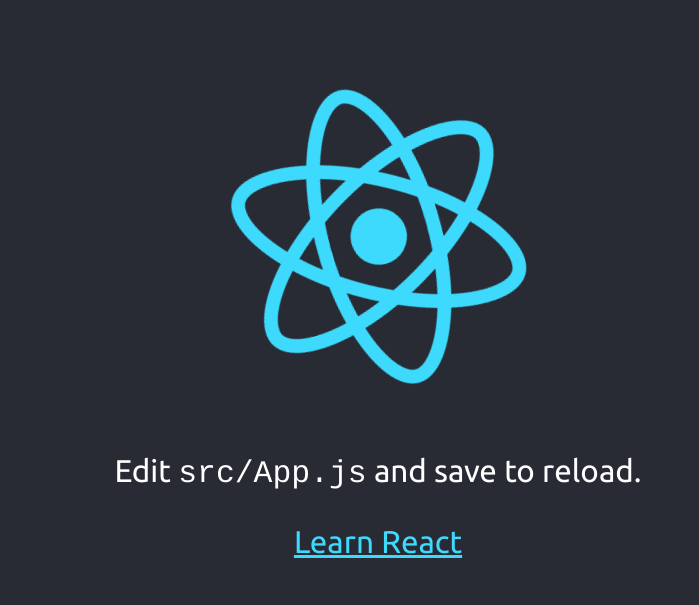
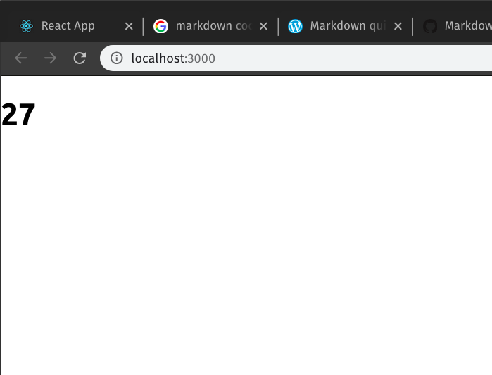
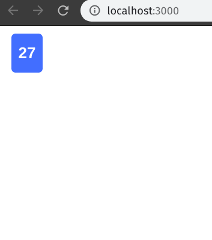
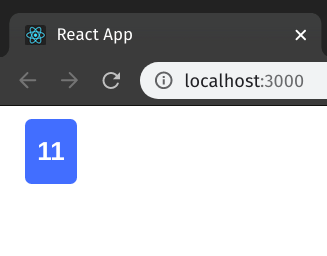

Let's initialize the project with a boiler plate. Previously, it was done using **create-react-app** but it is no longer supported. Now we need use npm to initialize the app. Check [here](https://github.com/facebook/create-react-app) for more information. The goal for today is to display a single card with any number specified.

```bash
npm init react-app is_this_your_card
```

Run the newly create app to make sure it's working.

```bash
npm start
```

If everything is okay you will the spinning React logo.



In the **src/App.js** remove everything inside **return()**. it should look something like this.

```js
function App() {
  return (

  );
}
```

Let's create a new component called **Card**. Make a new folder **components** inside **src** folder and create a new JSX file called **Card.jsx**.

src<br>
|-- components <br>
|---|-- Card.jsx

Type the following in the **Card.jsx** file.

```js
import React from "react";

export default function Card() {
  return (

  );
}
```

I used "ES7 React/Redux/GraphQL/React-Native snippets" in VS Code to speed up my workflow. You may check it out from [ES7 React/Redux/GraphQL/React-Native snippets extension](https://marketplace.visualstudio.com/items?itemName=dsznajder.es7-react-js-snippets).
With the extension, I can just type "rfc" followed by "Tab" and it will generate the above.

To make a card we need a rectangle box with a number inside. We will use a \<div> and an \<h1>.

```js
<div>
  <h1>27</h1>
</div>
```

Since **Card.jsx** is an external component, we will need to import and use it inside **App.js**.
Add this line at the top of **App.js** file

```js
import Card from './components/Card'
```

We can simply use the imported **Card** inside the \<div> of **App.js** just like this.

```js
function App() {
  return <Card />
}
```

And we get this.


The box is nowhere to be seen yet. We are gonna need some styling. Let's define two styles const inside **Card.jsx namely** "cardStyle" and "numStyle".

```js
const cardStyle = {
  display: 'flex',
  color: 'white',
  justifyContent: 'center',
  alignItems: 'center',
  width: '20px',
  height: '30px',
  backgroundColor: 'DodgerBlue',
  padding: '10px',
  fontFamily: 'Arial',
  borderRadius: '5px',
  margin: '10px 20px',
}

const numStyle = {
  fontSize: '20px',
}
```

Now we can use the styles in our \<div> and \<h1>.

```js
<div style={cardStyle}>
  <h1 style={numStyle}>27</h1>
</div>
```

Looks better now :)


Currently we can only get the card with number 27. For our card game we need 27 different numbers (1 to 27). We are going to make use of _props_ to achive this goal.
In our **Card.jsx** component, accept **props** as parameter.

```js
export default function Card(props)
```

Remove the previously used placeholder number **27** and retrieve the given number by using **{props.number}** in the **h1** tag inside **Card.jsx**. We need to use curly braces **{}** whenever we want to use objects inside the html elements.

_In Card.jsx_

```js
return (
  <div style={cardStyle}>
    <h1 style={numStyle}>{props.number}</h1>
  </div>
)
```

All that left to do is to pass in a number from **App.js** for \<Card> element. We can do this by putting **number={xx}** in the \<Card> where **xx** is the number to be displayed. Let's use number **11** for no apparent reason.

_In App.js_

```js
return <Card number={11} />
```

And viola! We have achieved our goal for part 2. Thanks for visiting. See you in part 2 :D



_Title Photo by_ <a style="background-color:black;color:white;text-decoration:none;padding:4px 6px;font-family:-apple-system, BlinkMacSystemFont, &quot;San Francisco&quot;, &quot;Helvetica Neue&quot;, Helvetica, Ubuntu, Roboto, Noto, &quot;Segoe UI&quot;, Arial, sans-serif;font-size:12px;font-weight:bold;line-height:1.2;display:inline-block;border-radius:3px" href="https://unsplash.com/@cliffordgatewood?utm_medium=referral&amp;utm_campaign=photographer-credit&amp;utm_content=creditBadge" target="_blank" rel="noopener noreferrer" title="Download free do whatever you want high-resolution photos from Clifford Photography"><span style="display:inline-block;padding:2px 3px"><svg xmlns="http://www.w3.org/2000/svg" style="height:12px;width:auto;position:relative;vertical-align:middle;top:-2px;fill:white" viewBox="0 0 32 32"><title>unsplash-logo</title><path d="M10 9V0h12v9H10zm12 5h10v18H0V14h10v9h12v-9z"></path></svg></span><span style="display:inline-block;padding:2px 3px">Clifford Photography</span></a> _on Unsplash_
