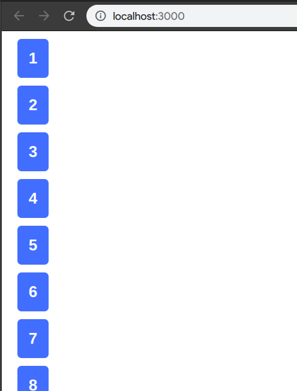
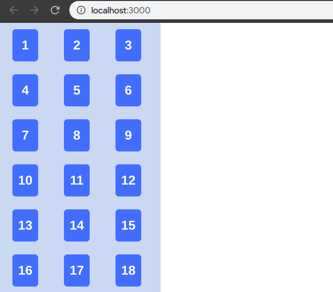
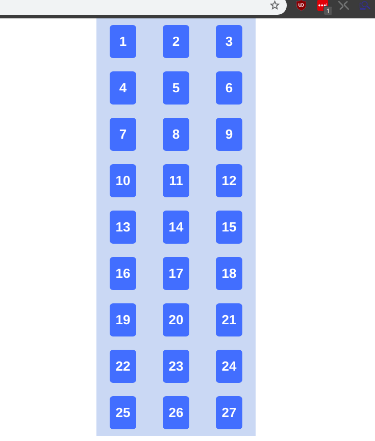

Today we will be creating a 9x3 grid of cards from the **Card** component we created in [part 2](./../Is_this_your_card_2).

We will need to store are numbers 1 to 27. So we need to make use of the famous **State** of React. In order to use **State** the our **App.js** must be class component. Unfortunately, due to my lack of foresight I created our **App.js** component as functional component. Not to worry, it's easy as pie to convert functional component to class component and vice versa.

###Step 1 of 3

Turn

```js
function App() {
```

Into

```js
class App extends Component {
```

###Step 2 of 3

Wrap **return \<Card number={11} />;** with **render()**

Before

```js
return <Card number={11} />
```

After

```js
  render() {
    return <Card number={11} />;
  }
```

###Step 3 of 3

import Component.

```js
import React, { Component } from 'react'
```

That's it! If you did everything correctly you will get the following.

```js
class App extends Component {
  render() {
    return <Card number={11} />
  }
}
```

Now we can add a **State** with the list of 27 numbers as an array.

```js
state = {
  numbers: [
    1,
    2,
    3,
    4,
    5,
    6,
    7,
    8,
    9,
    10,
    11,
    12,
    13,
    14,
    15,
    16,
    17,
    18,
    19,
    20,
    21,
    22,
    23,
    24,
    25,
    26,
    27,
  ],
}
```

Instead of adding 27 lines of \<Card> in **render()** we will make use of an ES6's higher order function, **map()**. We will remap the numbers from **state.numbers** into \<Card>.

**map** takes in a callback function in which we need to return an object; \<Card> in our case.

let's write a **renderGrid** function that returns the remapped components.

```js
renderGrid = () => {
  return this.state.numbers.map(num => {
    return <Card number={num} />
  })
}
```

We are passing in the following callback function inside **map**.

```js
num => {
  return <Card number={num} />
}
```

**num** is the current value from the array. For example, if it is the first iteration, the value of **num** would be **1**. If second iteration, **num** would be **2** and so on. So we just plug **num** into our **Card**'s **number** props and we get **27** components of **Card** without having to write messy 27 lines of code :). One good practice when using **map** is to assign a unique number to the **key** prop of the returning component so that **react** will easily know which items are being delete/added. Instead of using just **num** as parameter for our callback function, we will use another parameter called **index** or as we well all preferred to write, **i**. Our callback function will now look like this

```js
;(num, i) => {
  return <Card key={i} number={num} />
}
```



This is not quite what we wanted. it's a 27x1 grid. We want a 9x3 grid. And it's not centered :o. Let's use **CSS** to fix it. Go to **App.css** and delete everything inside it. Add a **className** called container to our main \<div> that wraps around the **renderGrid()** function.

```js
<div className="grid-container">
```

Write some styling for **grid-container** in **App.css**. Let's add a background for a start. You may choose any color you like.

```css
.grid-container {
  background-color: #cadcf3;
}
```

We need to set the **display** type to **flex** and use **wrap** for **flex-wrap**.

```css
.grid-container {
  background-color: #cadcf3;
  display: flex;
  flex-wrap: wrap;
}
```

With the above changes, we get flexible layout that wraps the **Card** components when the screen size changes.


It's better, but still not what we want. The cards try to fit it as much as column it can fit depending on the width. We want only 3 columns. From the video, we can see the optimal width for 3 columns is at about 240px. Fixing the width of **grid-container** to 240px should do the trick. It might cause some issue on smaller screens, but it should do for now.

```css
.grid-container {
  background-color: #cadcf3;
  display: flex;
  flex-wrap: wrap;
  width: 240px;
}
```

Much much better now :)



For the last step, let's center the grid by simply adding _margin : auto_ in the **.grid-container**.

```css
.grid-container {
  background-color: #cadcf3;
  display: flex;
  flex-wrap: wrap;
  width: 240px;
  margin: auto;
}
```

There you go, it's a centered grid with 9 rows 3 columns and we are done for part 3. See ya in part 4 :)


<br>
_Title Photo by_ <a style="background-color:black;color:white;text-decoration:none;padding:4px 6px;font-family:-apple-system, BlinkMacSystemFont, &quot;San Francisco&quot;, &quot;Helvetica Neue&quot;, Helvetica, Ubuntu, Roboto, Noto, &quot;Segoe UI&quot;, Arial, sans-serif;font-size:12px;font-weight:bold;line-height:1.2;display:inline-block;border-radius:3px" href="https://unsplash.com/@cliffordgatewood?utm_medium=referral&amp;utm_campaign=photographer-credit&amp;utm_content=creditBadge" target="_blank" rel="noopener noreferrer" title="Download free do whatever you want high-resolution photos from Clifford Photography"><span style="display:inline-block;padding:2px 3px"><svg xmlns="http://www.w3.org/2000/svg" style="height:12px;width:auto;position:relative;vertical-align:middle;top:-2px;fill:white" viewBox="0 0 32 32"><title>unsplash-logo</title><path d="M10 9V0h12v9H10zm12 5h10v18H0V14h10v9h12v-9z"></path></svg></span><span style="display:inline-block;padding:2px 3px">Clifford Photography</span></a> _on Unsplash_
