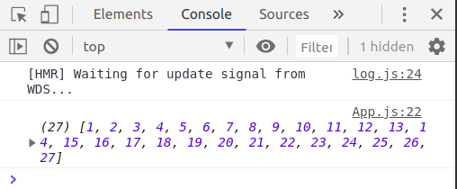
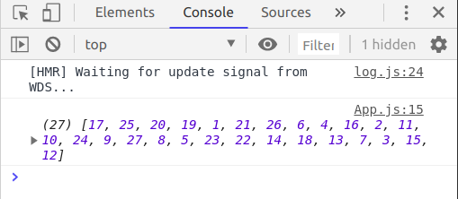
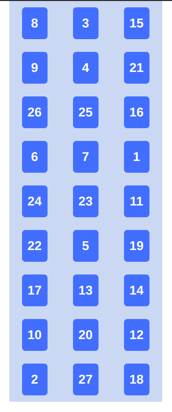

In this part we will learn how to randomize numbers from 1 to 27 for our cards' initial state. Currently we have 27 cards appear in the order, but we should randomize it to make our app more magical. Actually, the reason for this is to ensure the user won't find out how the trick works. If they see the same list of numbers every time, they can track where the cards went after each time they choose a card and they will figure out the trick.

We will need a constructor as the random numbers need to be generated and passed on to the **state** before the cards get rendered. Let's create the constructor and move the state declaration inside the constructor. For simplicity sake, let's remove the long list of 27 numbers as well.

```js
constructor(props) {
    super(props);

    this.state = {
      numbers: []
    };
  }
```

Notice that we need to add **this** keyword in front of **state**. The state is part of the component. Using it without **this** will cause error as it is not part of the **Constructor** scope.

For our random numbers, we will need non-repeated numbers from 1 to 27. I will not go into details about how to do that. It deserves it's own blog post. ~~I will link it here once I manage to write it up. For now you may check out this [post by Mike Bostock](https://bost.ocks.org/mike/shuffle/). That's where I learnt about this technique.~~ It's done. Check it out [here](./../Generate_unique_randoms/) Basically, we will generate 27 numbers in the order first then shuffle the numbers. Let's dive in :)

First declare a global variable for total number of cards. We should be able to change the total number of cards as I am worried 9 rows might be too long for phone screens. Might have to reduce it to 21 cards. When that happens we can simply change the global variable and it should not affect how the App works. Go ahead and declare it outside the class component.

```js
const TOTAL_CARDS = 27;

class App extends Component {
  ......
  ......
  ......
}
```

Next make an function that just populates and return numbers.

```js
getRandNumArray = () => {
  let numArray = []
  // Populate with TOTAL_CARDS numbers
  for (let i = 1; i <= TOTAL_CARDS; i++) numArray.push(i)
  return numArray
}
```

And call it and log it inside the constructor. Remember to call it with **this**.

```js
constructor(props) {
    super(props);

    this.state = {
      numbers: []
    };

    console.log(this.getRandNumArray());
  }
```

Go to the browser of your React App page. Open up the Developer Tools window (sometimes called inspector window). Mine is Chrome and the shortcut for Chrome is **Ctrl + Shift + I**. Click **Console** tab and you should be able to see your numbers from 1 to 27.



Let's add the main ingredient. Don't worry if you don't understand the shuffle portion of the code. ~~I promise I will write a blog post about it soon.~~ I have written it [here](./../Generate_unique_randoms/) But if you don't understand how I populated the numbers this tutorial series is not for you. I am afraid you will need to know basic React and Web dev (HTML, CSS, JavaScript) to follow this tutorial series.

```js
getRandNumArray = () => {
  let numArray = []

  // Populate with TOTAL_CARDS numbers
  for (let i = 1; i <= TOTAL_CARDS; i++) numArray.push(i)

  //Shuffle
  for (let j = TOTAL_CARDS - 1; j >= 0; j--) {
    let random = Math.floor(Math.random() * j)
    let tmp = numArray[random]
    numArray[random] = numArray[j]
    numArray[j] = tmp
  }
  return numArray
}
```

Go back to the browser and you should be able to see the non-repeated random numbers. Try refreshing the page and you will see the numbers shuffle each time.



All that's left to do now is to feed the numebers inside the state. Call **getRandNumArray** inside the state and assign it to **numbers**.

```js
this.state = {
  numbers: this.getRandNumArray(),
}
```

And.. we are done :)



_Title Photo by_ <a style="background-color:black;color:white;text-decoration:none;padding:4px 6px;font-family:-apple-system, BlinkMacSystemFont, &quot;San Francisco&quot;, &quot;Helvetica Neue&quot;, Helvetica, Ubuntu, Roboto, Noto, &quot;Segoe UI&quot;, Arial, sans-serif;font-size:12px;font-weight:bold;line-height:1.2;display:inline-block;border-radius:3px" href="https://unsplash.com/@cliffordgatewood?utm_medium=referral&amp;utm_campaign=photographer-credit&amp;utm_content=creditBadge" target="_blank" rel="noopener noreferrer" title="Download free do whatever you want high-resolution photos from Clifford Photography"><span style="display:inline-block;padding:2px 3px"><svg xmlns="http://www.w3.org/2000/svg" style="height:12px;width:auto;position:relative;vertical-align:middle;top:-2px;fill:white" viewBox="0 0 32 32"><title>unsplash-logo</title><path d="M10 9V0h12v9H10zm12 5h10v18H0V14h10v9h12v-9z"></path></svg></span><span style="display:inline-block;padding:2px 3px">Clifford Photography</span></a> _on Unsplash_
