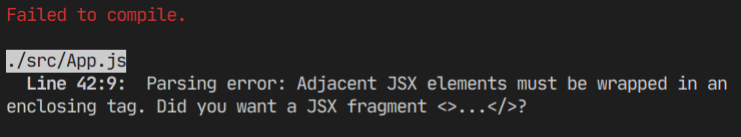
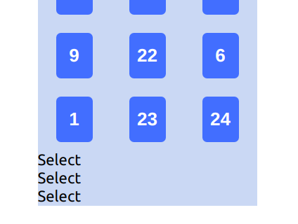
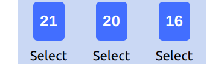
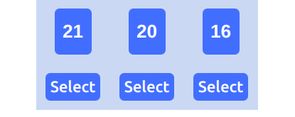

Today we will be creating buttons that will rearrange columns to rows when clicked. For this part we will just add the buttons. The functionality will come in the next part.
We will be using **div**s as buttons and they will be placed under each columns. Let's create 3 **div**s inside a **div**. I gave them class names as we are gonna do some basic styling later.

```html
<div className="buttons-container">
  <div className="button">Select</div>
  <div className="button">Select</div>
  <div className="button">Select</div>
</div>
```

I want the buttons section and the cards section to be separated from the cards.

```html
<div className="grid-container">{this.renderGrid()}</div>
// highlight-start
<div className="buttons-container">
  <div className="button">Select</div>
  <div className="button">Select</div>
  <div className="button">Select</div>
</div>
// highlight-end
```

However, doing so will cause compilation error on React as below. That's because the **App.js** component is returning two **div**s instead of a single div.



In React, the returning component must be a single node. There can be many nested children inside the node. But there must be only one node. We can simply solve this by wrapping both cards div and buttons div inside a single div element. Let's call give a **className** of _main_ while we are at it.

```html
// highlight-next-line
<div className="main">
  <div className="grid-container">{this.renderGrid()}</div>
  <div className="buttons-container">
    <div className="button">Select</div>
    <div className="button">Select</div>
    <div className="button">Select</div>
  </div>
  // highlight-next-line
</div>
```

And we should move some of the **CSS** styling from _grid-container_ into the main styling as _main_ is now the overall content container. Basically, we just need **flex-wrap** inside the _grid-container_.

```css
// highlight-start
.main {
  width: 240px;
  margin: auto;
  background-color: #cadcf3;
}
// highlight-end

.grid-container {
  // highlight-next-line
  /* background-color: #cadcf3; */
  display: flex;
  flex-wrap: wrap;
  // highlight-start
  /* width: 240px;
  margin: auto; */
  // highlight-end
}
```



Not great, pretty terrible. The buttons should be in a row directly under their respective columns. And they have no border to look like buttons. Let's fix that.

To get them to display in a row, we need to set the **display** to _flex_ and **width** to 100% of the main **div** (240px). And set **justify-content** to _space-around_ so that the buttons will be spaced out evenly.

```css
.buttons-container {
  display: flex;
  width: 100%;
  justify-content: space-around;
  margin: auto;
}
```



Not great, getting better. We just need some styling for the buttons. Most of the styling are self-explanatory. I added **margin-top** and **margin-bottom** as I saw the gap between the buttons and border of the _main_ **div** is too close. Let me know in the comment if you need explanation for any of the styling choices.

```css
.button {
  background-color: dodgerblue;
  border-radius: 5px;
  padding: 5px;
  margin-bottom: 10px;
  margin-top: 10px;
  font-weight: 500;
  color: white;
}
```

.

Alright, I am happy with this result. I am aware that even though the positioning is solid for now the aesthetic doesn't look great. Don't worry. We will be beautifying the final product at the end. It's better to get functionality working well first and then beautify it later. That's it for today. I hope you enjoyed the tutorial :)

_Title Photo by_ <a style="background-color:black;color:white;text-decoration:none;padding:4px 6px;font-family:-apple-system, BlinkMacSystemFont, &quot;San Francisco&quot;, &quot;Helvetica Neue&quot;, Helvetica, Ubuntu, Roboto, Noto, &quot;Segoe UI&quot;, Arial, sans-serif;font-size:12px;font-weight:bold;line-height:1.2;display:inline-block;border-radius:3px" href="https://unsplash.com/@cliffordgatewood?utm_medium=referral&amp;utm_campaign=photographer-credit&amp;utm_content=creditBadge" target="_blank" rel="noopener noreferrer" title="Download free do whatever you want high-resolution photos from Clifford Photography"><span style="display:inline-block;padding:2px 3px"><svg xmlns="http://www.w3.org/2000/svg" style="height:12px;width:auto;position:relative;vertical-align:middle;top:-2px;fill:white" viewBox="0 0 32 32"><title>unsplash-logo</title><path d="M10 9V0h12v9H10zm12 5h10v18H0V14h10v9h12v-9z"></path></svg></span><span style="display:inline-block;padding:2px 3px">Clifford Photography</span></a> _on Unsplash_
