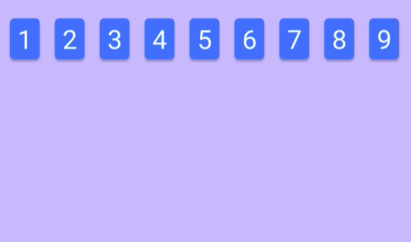

In part 5 we added the buttons. Now let's implement the columns to rows re-arrangement. First of all, let's comment out the shuffling part when the cards are created. It will be easier to check if our columns have been arranged into rows. We will uncomment it back when done.

```js
getRandNumArray = () => {
  let numArray = []

  // Populate with TOTAL_CARDS numbers
  for (let i = 1; i <= TOTAL_CARDS; i++) numArray.push(i)

  //Shuffle
  // highlight-start
  // for (let j = TOTAL_CARDS - 1; j >= 0; j--) {
  //   let random = Math.floor(Math.random() * j);
  //   let tmp = numArray[random];
  //   numArray[random] = numArray[j];
  //   numArray[j] = tmp;
  // }
  // highlight-end
  return numArray
}
```

There are a few steps required to achieve our goal for this part. Let me visualize them in fancy animations so it would be easier understand. I will just use 9 numbers in the animations to ease my workload.

This is what we have in the state once we initialize the numbers in array.


This is how it is being rendered in our **APP**. Remember we set the flex wrap and limit the width to 240px to achieve 3 columns.



For our goal, we want the first column to become [1,4,7], 2nd column to [2,5,8] and the the last one to [3,6,9]. And finally they all should join to become 1 long array [1,4,7,2,5,8,3,6,9].


We will need a very simple algorithm for that. So, let's find the pattern. From the picture below, we can see that the next index for the first row can be calculated by adding 3 to previous index.


The same goes for 2nd column and of course the 3rd column.


With that in mind let's start coding. First let's create some global **const** for the columns and cards.

```js
const TOTAL_COL = 3
const CARDS_PER_COL = TOTAL_CARDS / TOTAL_COL
```

Then create a function called colToRows which accepts the column number being selected.

```js
colToRows = colNumber => {
  let newNumbers = []
  for (let i = 0; i < TOTAL_COL; i++) {
    newNumbers.push(this.state.numbers[i])
  }
  console.log(newNumbers)
}
```

The **for** loop is looping through each colum for a total of 3 times.Note that we need the first number of the column as the first number of the row as well. Hence, the **newNumbers.Push()** in the main loop. Inside the loop, we need a nested loop that will push numbers into **newNumbers** every 3rd index.

```js
colToRows = colNumber => {
  let newNumbers = []
  for (let i = 0; i < TOTAL_COL; i++) {
    newNumbers.push(this.state.numbers[i])
    // highlight-start
    for (let j = i + 3; j < TOTAL_CARDS; j += 3) {
      newNumbers.push(this.state.numbers[j])
    }
    // highlight-end
  }
  console.log(newNumbers)
}
```

Please take note that for the nested loop we are taking the numbers only every 3rd index with **j += 3**. To test this, we need to pass the function to **onClick** event of our button divs. We have to pass the **colToRows** function by assigning it to anonymous arrow function because the function accepts an argument, assigning **this.colToRows(x)** to onClick will cause the function to be executed immediately instead of when the button is clicked.

```js
<div className="button" onClick={() => this.colToRows(1)}>
  Select
</div>
<div className="button" onClick={() => this.colToRows(2)}>
  Select
</div>
<div className="button" onClick={() => this.colToRows(3)}>
  Select
</div>
```

From the console log, we can see that our little column to rows algorithm is working perfectly :)


Nice! now we simply need to set the **newNumbers** as our **this.state.numbers**.

```js
colToRows = colNumber => {
  let newNumbers = []
  for (let i = 0; i < TOTAL_COL; i++) {
    newNumbers.push(this.state.numbers[i])
    for (let j = i + 3; j < TOTAL_CARDS; j += 3) {
      newNumbers.push(this.state.numbers[j])
    }
  }
  console.log(newNumbers)
  // highlight-next-line
  this.setState({ numbers: newNumbers })
}
```

And the result is great.


We have one more thing we need to take care of. I want the numbers from the selected column to be sandwiched between the other columns. It would be like **[col a, selected col, col b]**.

First, split the numbers into 3 columns by using JavaScript's **Slice** method.

```js
let col_1 = newNumbers.slice(CARDS_PER_COL * 0, CARDS_PER_COL) // 1 to 9
let col_2 = newNumbers.slice(CARDS_PER_COL * 1, CARDS_PER_COL * 2) // 10 to 18
let col_3 = newNumbers.slice(CARDS_PER_COL * 2, CARDS_PER_COL * 3) // 19 to 27
```

And then put the selected column in the middle by using the spread (...) operator.

```js
switch (colNumber) {
  case 1:
    newNumbers = [...col_2, ...col_1, ...col_3]
    break

  case 2:
    newNumbers = [...col_1, ...col_2, ...col_3]
    break

  case 3:
    newNumbers = [...col_1, ...col_3, ...col_2]
    break

  default:
    break
}
```

And finally we are done for the day.


_Title Photo by_ <a style="background-color:black;color:white;text-decoration:none;padding:4px 6px;font-family:-apple-system, BlinkMacSystemFont, &quot;San Francisco&quot;, &quot;Helvetica Neue&quot;, Helvetica, Ubuntu, Roboto, Noto, &quot;Segoe UI&quot;, Arial, sans-serif;font-size:12px;font-weight:bold;line-height:1.2;display:inline-block;border-radius:3px" href="https://unsplash.com/@cliffordgatewood?utm_medium=referral&amp;utm_campaign=photographer-credit&amp;utm_content=creditBadge" target="_blank" rel="noopener noreferrer" title="Download free do whatever you want high-resolution photos from Clifford Photography"><span style="display:inline-block;padding:2px 3px"><svg xmlns="http://www.w3.org/2000/svg" style="height:12px;width:auto;position:relative;vertical-align:middle;top:-2px;fill:white" viewBox="0 0 32 32"><title>unsplash-logo</title><path d="M10 9V0h12v9H10zm12 5h10v18H0V14h10v9h12v-9z"></path></svg></span><span style="display:inline-block;padding:2px 3px">Clifford Photography</span></a> _on Unsplash_
