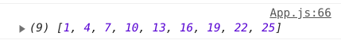
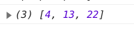
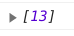

In this part we will build the logic for guessing the card the user had chosen.

First we need to store the first colum selected by the user in the **state**. When a user selects another column the next time, we will compare the numbers from the previous column (stored in state) and the current column and choose the numbers that are in both columns.

Add a new **possibleNums** array in state.

```js
this.state = {
  numbers: this.getRandNumArray(),
  // highlight-next-line
  possibleNums: [],
}
```

Then we can update the **state** with the column the user selected. Since we have already put the selected column in the middle of the **newNumbers**, we can just extract it back and set it for **possibleNums**. But before that we need to compare the current column with the previous column and only update what's common.

Let's define 3 arrays inside the **colToRows** function.

```js
let prvPosNums = this.state.possibleNums
let curPosNums = newNumbers.slice(CARDS_PER_COL * 1, CARDS_PER_COL * 2)
let newPosNums = []
```

If it is the first time, the **possibleNumbers** will be empty. In this case we can just set the all the possible numbers from current column as new numbers.

```js
let prvPosNums = this.state.possibleNums
let curPosNums = newNumbers.slice(CARDS_PER_COL * 1, CARDS_PER_COL * 2)
let newPosNums = []
// highlight-start
if (prvPosNums.length === 0) {
  newPosNums = curPosNums
}
// highlight-end
```

If not, we can just push the common numbers to the newPosNumbers.

```js
if (prvPosNums.length === 0) {
  newPosNums = curPosNums
}
// highlight-start
else {
  prvPosNums.forEach(n => {
    if (curPosNums.includes(n)) newPosNums.push(n)
  })
}
// highlight-end
```

After that, we can just update the state.

```js
let prvPosNums = this.state.possibleNums
let curPosNums = newNumbers.slice(CARDS_PER_COL * 1, CARDS_PER_COL * 2)
let newPosNums = []
if (prvPosNums.length === 0) {
  newPosNums = curPosNums
} else {
  prvPosNums.forEach(n => {
    if (curPosNums.includes(n)) newPosNums.push(n)
  })
}
this.setState({
  numbers: newNumbers,
  // highlight-next-line
  possibleNums: newPosNums,
})
```

We can test this by adding a callback function inside **setState**. The reason we are using callback function instead of calling **console.log** after **setState** is that **setState** is asynchronous. Therefore, if we log the state value right after **setState** is called, we might not get the updated value. More on this at <https://reactjs.org/docs/faq-state.html.>

```js
this.setState(
  {
    numbers: newNumbers,
    possibleNums: newPosNums,
  },
  // highlight-start
  () => {
    console.log(this.state.possibleNums)
  }
  // highlight-end
)
```

To test this, you need to pick a number and select the column the number is in for 3 times. On the third time, **possibleNums** should only have the number you picked.

let's say I chose number 13 which is on the first column. After I clicked **Select** the first time, I will get the following as my possible numbers.



Now the number 13 is in column 2. After clicking **Select** on the 2nd column, the possible numbers size is reduced to 3 numbers.



Finally, after the 3rd select, the my number is the only number left.



Good progress. That's it for today. Let me know in the comments if you have any questions. Thanks for visiting my blog :)

_Title Photo by_ <a style="background-color:black;color:white;text-decoration:none;padding:4px 6px;font-family:-apple-system, BlinkMacSystemFont, &quot;San Francisco&quot;, &quot;Helvetica Neue&quot;, Helvetica, Ubuntu, Roboto, Noto, &quot;Segoe UI&quot;, Arial, sans-serif;font-size:12px;font-weight:bold;line-height:1.2;display:inline-block;border-radius:3px" href="https://unsplash.com/@cliffordgatewood?utm_medium=referral&amp;utm_campaign=photographer-credit&amp;utm_content=creditBadge" target="_blank" rel="noopener noreferrer" title="Download free do whatever you want high-resolution photos from Clifford Photography"><span style="display:inline-block;padding:2px 3px"><svg xmlns="http://www.w3.org/2000/svg" style="height:12px;width:auto;position:relative;vertical-align:middle;top:-2px;fill:white" viewBox="0 0 32 32"><title>unsplash-logo</title><path d="M10 9V0h12v9H10zm12 5h10v18H0V14h10v9h12v-9z"></path></svg></span><span style="display:inline-block;padding:2px 3px">Clifford Photography</span></a> _on Unsplash_
