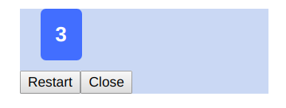
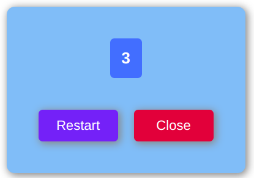
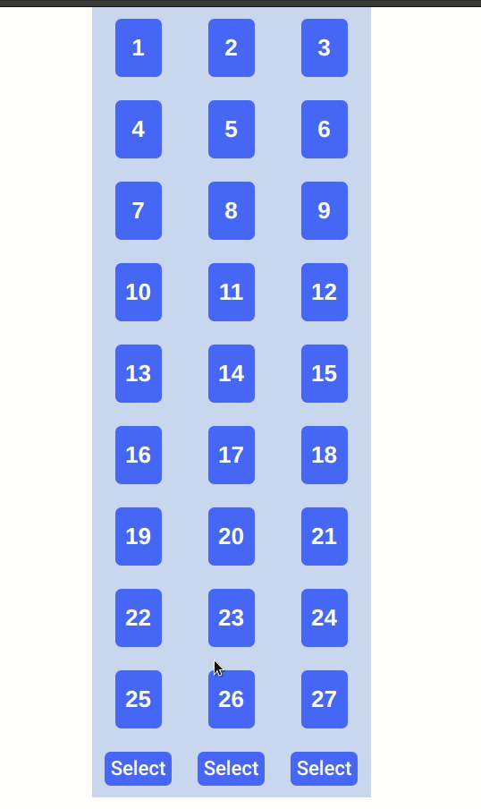

## How to make a Popup in React

In this part we will crate a decent looking Popup that will show the number that the user has picked.

For the Popup, we will create a new component. Inside `components`, add a new file called `Popup.jsx` and create a skeleton functional component.

```jsx
import React from "react";

export default function Popup() {
  return <div></div>;
}
```

Inside the popup we will reveal the user's card and prompt the use if they want to try again or close the popup.

```jsx
import React from "react";
// highlight-next-line
import Card from "./Card";

export default function Popup() {
  return (
    // highlight-start
    <div>
      <Card number={} />
      <div>
        <button>Restart</button>
        <button>Close</button>
      </div>
    </div>
    // highlight-end
  );
}
```

We need to pass the user's number via `props` for the `<Card>` component's `num`.

```jsx
export default function Popup(props) {
```

```jsx
<Card number={props.number} />
```

In order to see the result, we can temporarily display it in our `App.js`. Import `Popup.jsx` into `App.js`.

```jsx
import Popup from "./components/Popup";
```

Add the component right below the main `div`.

```jsx
<div className="main">
  <Popup number={3}  />
```

Comment out the cards temporarily so that we will only see our popup.

```jsx
{
  /* <div className="grid-container">{this.renderGrid()}</div>
    <div className="buttons-container">
      <div className="button" onClick={() => this.execute(1)}>
        Select
      </div>
      <div className="button" onClick={() => this.execute(2)}>
        Select
      </div>
      <div className="button" onClick={() => this.execute(3)}>
        Select
      </div>
    </div> */
}
```

We will get something like this.



It doesn't look good. So let's do some styling.

Add a `Popup.css` file inside `src/components/styles`.

Let's add some `classNames` for our Popup.

```jsx
<div className="container">
  <div className="content">
    <Card number={props.number} />
    <div className="btnContainer">
      <button className="btn btn-restart">Restart</button>
      <button className="btn btn-close">Close</button>
    </div>
  </div>
</div>
```

Let's write some `CSS` in `Popup.css`.

For `container` class we need the position to be fixed and the the `z-index` to be `1` to make it appear on top of everything. Also, we will set the `top` and `left` to `50%`. This won't put the popup at the exact center yet. We still need to subtract the half of the width and height of the popup by using `transform`.

```css
.container {
  position: fixed;
  z-index: 1;
  top: 50%;
  left: 50%;
  transform: translate(-50%, -50%);
}
```

For `content` we need to align the items vertically and add a few cosmetic parameters to make it look nice. It's up to you if you want to add more.

```css
.content {
  display: flex;
  flex-direction: column;
  align-items: center;
  background-color: #84c4f5;
  padding: 30px;
  border-radius: 10px;
  box-shadow: 5px 5px 10px 3px #888;
}
```

For `btnContainer` we need to display buttons in a row and leave some top margin to make it look less clustered.

```css
.btnContainer {
  display: flex;
  flex-direction: row;
  margin-top: 20px;
}
```

For `btn btn-restart btn-close` are self-explanatory.

```css
.btn {
  background-color: green;
  border: none;
  border-radius: 5px;
  margin: 10px;
  width: 100px;
  height: 40px;
  font-size: 1em;
  color: white;
  box-shadow: 1px 1px 3px 1px #888888;
}

.btn-restart {
  background-color: #5670f5;
}

.btn-close {
  background-color: #d11d44;
}
```

Looks much better now.



But the buttons do not give some visual feedback when hovering or clicking. We can add some simple animations for that. We will add a border around the buttons and move the buttons up a bit when hovering and move back down when clicked. And also we will change the mouse pointer to finger cursor to let the user know it's clickable.

```css
.btn:hover {
  border: 3px solid rgba(0, 0, 0, 0.25);
  transform: translateY(-3px);
  cursor: pointer;
}

.btn:active {
  transform: translateY(+3px);
}
```

Looking good for now. Let's try to trigger the popup when the user's number is ready to reveal, which is when the `stage` equals to `3`. Also we need to pass the user's number, `possibleNums`, as well. So comment out the hard-coded `props` we passed to `Popup.jsx` for debugging purpose and replace them will correct values.

```css
// highlight-next-line
/* <Popup number={3} isVisible={true} /> */
<Popup
  number={this.state.possibleNums}
  isVisible={this.state.stage === 3 ? true : false}
  />
```

In `Popup.js`, return `null` if `props.isVisible` is set to false.

```jsx
export default function Popup(props) {
  if (!props.isVisible) return null;
......}
```

Now the popup will only show after the third select and it will show the correct number. Give it a try.



For the next part we need to reset the game to initial state when the user click `Restart`. We will need to pass a reset function from the `App.js` to `Popup.jsx` via `props`.

In the `App.js` add a `reset` function that resets the state.

```jsx
reset = () => {
  this.setState({
    numbers: this.getRandNumArray(),
    possibleNums: [],
    stage: 0,
  });
};
```

Next pass the function to `Popup.jsx` via `props`.

```jsx
<Popup
  number={this.state.possibleNums}
  isVisible={this.state.stage === 3 ? true : false}
  // highlight-next-line
  restartHandler={this.reset}
/>
```

From the `Popup.jsx` use the new `prop` as `onClick` handler.

```jsx
<button onClick={props.restartHandler} className="btn btn-restart">
  Restart
</button>
```

I am not sure what to do with `Close` button right now. Let's say a user click the button and the Popup is dismissed, the user won't be able to play the game again and kinda have to refresh the browser. It feels redundant. I might remove it later on. But let's keep it for now.

_Title Photo by_ <a style="background-color:black;color:white;text-decoration:none;padding:4px 6px;font-family:-apple-system, BlinkMacSystemFont, &quot;San Francisco&quot;, &quot;Helvetica Neue&quot;, Helvetica, Ubuntu, Roboto, Noto, &quot;Segoe UI&quot;, Arial, sans-serif;font-size:12px;font-weight:bold;line-height:1.2;display:inline-block;border-radius:3px" href="https://unsplash.com/@cliffordgatewood?utm_medium=referral&amp;utm_campaign=photographer-credit&amp;utm_content=creditBadge" target="_blank" rel="noopener noreferrer" title="Download free do whatever you want high-resolution photos from Clifford Photography"><span style="display:inline-block;padding:2px 3px"><svg xmlns="http://www.w3.org/2000/svg" style="height:12px;width:auto;position:relative;vertical-align:middle;top:-2px;fill:white" viewBox="0 0 32 32"><title>unsplash-logo</title><path d="M10 9V0h12v9H10zm12 5h10v18H0V14h10v9h12v-9z"></path></svg></span><span style="display:inline-block;padding:2px 3px">Clifford Photography</span></a>`on Unsplash.
