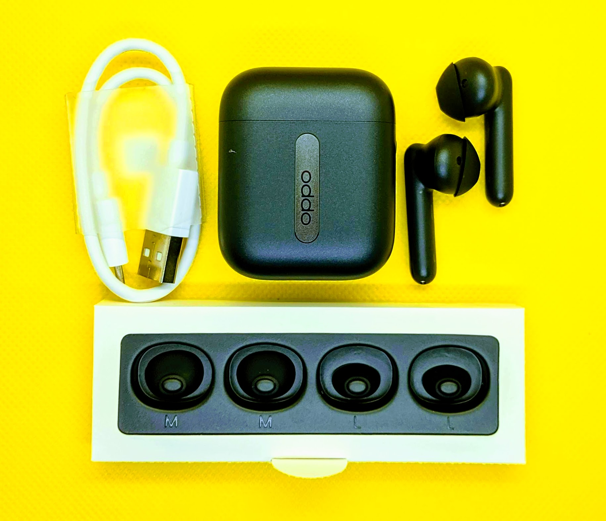
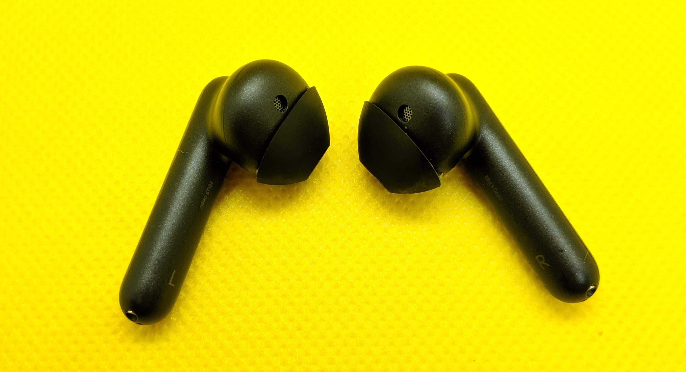
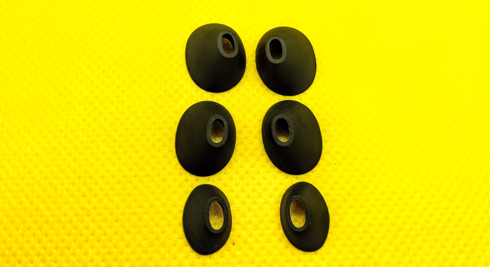
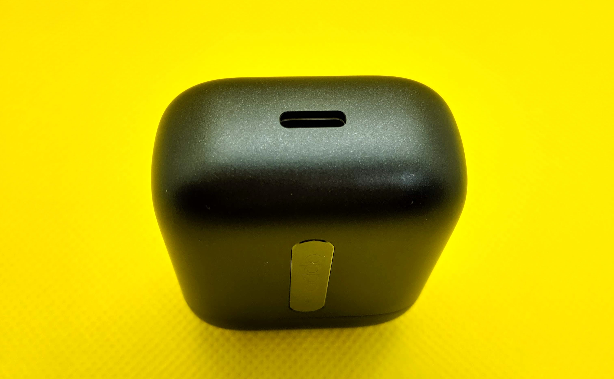

#### Intro

**TL;DR** : I don't like earpiece that enters deep into the ear canal. I am looking for TWS that does not do that. **Oppo Enco Free** seems to fit my need. Or is it?

I have a problem when it comes to using an earpiece. I can't use earpieces that go deep inside the ear canal completely blocking the air (and the noise of course). While it offers excellent passive noise isolation, it makes me feel very uncomfortable and I could never get used to it. The only earpiece I have ever felt totally comfortable was **Panasonic Ergofit**. However, those are wired and as smart phones beginning to shift towards no-headphone-jack paradigm, I desperately have to look for an wireless earpiece that is as comfortable as my **Ergofit**. I have tried quite a few TWS earbuds, yet nothing comes close to the comfort of the legendary **Ergofit**. I tried Apple **Airpods**. Though it does not enter my ear canal, it does not offer any isolation for passive noise blocking as it does not have the silicon tips to partially seal the ear canal. (For me, **Ergofit** block quite a lot of noise, FYI). So when I saw Oppo announced **Oppo Enco Free**, I realize that it is Airpods clone with silicon seal that should block some noise without poking inside the ear canal. Just exactly what I need, right? Let's see about that.

## 1. What's in the box

I bought it for about SGD$95 after coupons and discounts from **Shopee**. I believe that's in the above average price range, in my opinion, for what it can offer. Inside the box, it comes with 2 different size silicon tips as well as a short **USB Type C** charging cable. Nothing fancy.

Take note that the tips are custom shaped and are not interchangeable with third party tips. I tried with my extra tips from other earbuds. Though it could fit the nozzle, it can't fit back inside the charging case.

## 2. Comfort & Fit

The earbuds sit comfortably outside my ear canal thanks to the silicon tips design that's different from Airpods. Among the 3 sizes included, the largest tip seems to fit my ear best.

I can go on for hours listening to music without feeling fatigue. It is very lightweight and compact.

In terms of Fit, I find myself adjusting a few times as sometimes it feels like it's going to dropout after a while. Even though it gave me that impression of dropping out, it never did despite taking stairs and my heavy head shaking test.

Unfortunately, the earbuds seal poorly thus it does not block the passive noise as much as I expected (compared to my Ergofit). When I take train I had to set the volume to max in order to hear the music properly. Even at max volume, I can still very much hear the outside noise.

So I gotta give it **6 / 10** for the Comfort and Fit mainly because of the poor isolation.

## 3. Audio Quality

**Oppo Enco Free** has decent sound quality (though not on per with ErgoFit). It has good enough sound stage and nice separation. However, the bass is just meh. I like bass heavy sound signature when it comes to listing music. **Oppo's** bass is there, but not enough for me. Luckily, when I tuned the bass from my Spotify app, I can feel the bass better without any distortion.

When it comes to connection, I did not notice any lag when watching Youtube and Netflix on my android phone. However, there's minor lag when gaming.

Like I said in the **Comfort and Fit** section, **Enco Free** offers average noise isolation. It affects the sound quality largely as I can still hear other people talking when I am outside.

I will give **7 / 10** for the audio quality.

## 4. Battery life

Oppo claims that **Enco Free** has 5 + 20 Hours of music playback and 3 + 12 Hours of call time. In my experience, it lives up to the claim. I spent about 4 to 5 hours a day listening to music and watching videos, and I charge it like once every 3 weeks. The stand-by time is quite good as well. I left it unused for about 3 weeks after a full charge, and when I picked it up it still had 90% battery.

**8 / 10** for the battery life.

## 5. Features

**Enco Free** has IPX4 water resistance, meaning it can withstand water splash, but not suitable for swimming.

It does not come with wireless charging, however it's good to see "USB Type C" for charging. There is a button on the side for pairing. The pairing process was quick and easy and I had no problem pairing with my Android phone.

The best thing I like about **Enco Free** is its touch control. You can skip forward, skip backward, play, pause, and volume up, down. The volume up down control is quite rare to see in TWS. You can swipe up for volume up and swipe down for volume down on the left earbud. For skipping forward and backward, it's the same gesture but on the right side of the earbud. Double tapping on either side of the earbud will play/pause the music, though this does not seem to work very well. It also has in-ear detection which will pause the music when taken out of the ear and play again when put back it. This feature also does not work every time.

Lastly, **Oppo Enco Free** does not have multi device connection feature.

Rating : **7 / 10**

## 6. Microphone

Microphone works decently on **Enco Free**. The mic is located at the very end of the stern which points directly to the mouth. When I made calls the other side can hear me well. It provides some noise cancellation (For calls only) and it works as intended. **8 / 10**

## 7. Conclusion

Although I didn't not like the quality of passive noise isolation, I would recommend it if you intend to use it in quiet environment. It has comfortable fit and useful features that does not break the bank. I personally will not use it as the bad noise blocking is a deal breaker for me.

Overall Rating : **7.2 / 10**
